# DemoGod 🎬

<p align="center">
  
</p>

> Demo video generator for GitHub Copilot CLI

https://github.com/suuus/demogod/raw/main/docs/showcase.mp4

[](https://www.typescriptlang.org/)
[](https://nodejs.org/)
[](LICENSE)

## Overview

DemoGod is a web-based tool that creates interactive demo videos for GitHub Copilot CLI. It provides a terminal interface that can execute scripted demos or connect to a real Copilot session for live demonstrations.

**Use Cases:**
- Create polished demo videos for presentations
- Test Copilot interactions in a controlled environment
- Record reproducible demo sequences
- Showcase GitHub Copilot CLI capabilities

## Getting Started

### Prerequisites

- **Node.js** v20 or higher ([Download](https://nodejs.org/))
- **npm** package manager
- **GitHub Copilot CLI** access (for live sessions)

### Installation

```bash
git clone https://github.com/suuus/demogod.git
cd demogod
npm install
```

### Running

```bash
# Development mode with auto-reload
npm run dev

# Production mode
npm start
```

Open `http://localhost:3456` in your browser. Customize the port with `PORT=8080 npm start`.

### Desktop App (macOS)

Run DemoGod as a native macOS window using [Tauri v2](https://v2.tauri.app/). Requires the [Rust toolchain](https://rustup.rs/).

```bash
npm run desktop
```

> Production builds for all platforms are coming soon.

## Features

- **Scripted & Live Demos** — Execute pre-recorded demo scripts or send real prompts to Copilot
- **Demo Picker** — Choose demos via the mode button, with UI automation (layout switches, model changes, file opens)
- **Real-time Streaming** — See Copilot responses as they are generated
- **Tool Execution Visualization** — Watch tool calls and their results in real-time
- **Multi-Session** — Run multiple Copilot sessions in tabs or floating windows with grid snapping
- **Sub-Agent Activity Tabs** *(experimental)* — Track sub-agent tasks in dedicated tabs
- **Project Browser** — Browse and select working directories for Copilot sessions
- **File Change Tracking** — Monitor file modifications during demo execution
- **Screen Recording** — Built-in recording button — records the browser tab and downloads as `.webm`
- **Copy & Paste** — Select and copy response text, paste into prompts
- **Settings Panel** — Configure appearance, feature flags, and experimental options from ⚙️ Settings

## Keyboard Shortcuts

| Shortcut | Action |
|----------|--------|
| <kbd>Ctrl</kbd>+<kbd>T</kbd> (Mac) / <kbd>Alt</kbd>+<kbd>T</kbd> | New session |
| <kbd>Ctrl</kbd>+<kbd>W</kbd> (Mac) / <kbd>Alt</kbd>+<kbd>W</kbd> | Close current session |
| <kbd>Ctrl</kbd>+<kbd>N</kbd> (Mac) / <kbd>Alt</kbd>+<kbd>N</kbd> | Next session |
| <kbd>Ctrl</kbd>+<kbd>P</kbd> (Mac) / <kbd>Alt</kbd>+<kbd>P</kbd> | Previous session |

## Demo Scripts

Demo scripts are JSON files in `demos/`. The mode button (⌨️) opens a picker to choose which demo to run.

### Step Types

| Type | Description |
|------|-------------|
| `command` | Typed prompt + canned response (scripted) |
| `question` | Typed prompt + dialog with auto-fill + canned response |
| `live` | Typed prompt sent as a **real** Copilot prompt — waits for idle before next step |
| `action` | UI automation — switch layout, change model, tile windows, open files |

### Example — Live Demo

```json
{
  "title": "Feature Showcase",
  "steps": [
    { "type": "live", "text": "What is this project?", "typingSpeed": 40, "pauseAfter": 3000 },
    { "type": "action", "action": "layout", "value": "floating", "pauseAfter": 2000 },
    { "type": "action", "action": "tile", "pauseAfter": 1500 },
    { "type": "action", "action": "model", "value": "claude-sonnet-4", "pauseAfter": 1000 },
    { "type": "live", "text": "Run the tests", "typingSpeed": 40, "pauseAfter": 3000 },
    { "type": "action", "action": "layout", "value": "tabs", "pauseAfter": 1500 }
  ]
}
```

### Example — Scripted Demo

```json
{
  "steps": [
    {
      "type": "command",
      "text": "what can you help me with?",
      "typingSpeed": 45,
      "response": "I can help you with software engineering tasks..."
    }
  ]
}
```

A tiny demo project is included at `demo/sample-app/` — point DemoGod's project picker at it for a great demo experience.

## Project Structure

```
demogod/
├── src/
│   ├── server.ts           # Express + WS server, REST API, plugin scanners, demo engine
│   ├── copilot-bridge.ts   # Copilot SDK wrapper, event forwarding, sub-agent detection
│   └── public/             # Static frontend (HTML/CSS/vanilla JS — no build step)
├── src-tauri/              # Tauri desktop app (Rust + config)
├── demo/sample-app/        # Tiny Node.js project for demo showcase
├── demos/                  # Demo script JSON files
├── docs/ARCHITECTURE.md    # Detailed architecture reference
└── package.json
```

For API endpoints, WebSocket protocol, security model, and component deep-dives, see **[`docs/ARCHITECTURE.md`](docs/ARCHITECTURE.md)**.

## Development

The project uses `tsx` for TypeScript execution with hot reload. The frontend is intentionally vanilla JS with no build step.

### Adding New Demos
1. Create a JSON file in the `demos/` directory
2. Define the step sequence (commands and responses)
3. Load it via the demo picker or `/api/demos/:name`

## Troubleshooting

**Integrated terminal not working (macOS):**
- The `node-pty` native addon requires an executable `spawn-helper` binary
- Run `npm run postinstall` to fix permissions (this runs automatically on `npm install`)
- If you switched Node versions, run `npm rebuild node-pty`

**Port already in use:**
```bash
PORT=8080 npm start
```

**WebSocket connection fails:**
- Ensure the server is running on `localhost:3456`
- Check browser console for detailed error messages

**Copilot SDK errors:**
- Check your GitHub authentication: `gh auth status`
- Verify the `@github/copilot-sdk` package is installed

**Debug mode:**
```bash
DEBUG=* npm start
```

## Roadmap

- [x] Live demo mode (real Copilot prompts)
- [x] Multiple session management
- [x] Sub-agent activity tabs
- [x] Demo UI automation (layout, model, tile)
- [x] Screen recording
- [x] Copy & paste in session windows
- [ ] Export demos as video files
- [ ] Custom themes and styling options
- [ ] Saved layout presets
- [ ] Desktop app production builds (Windows, Linux)

## Automated Workflows

DemoGod uses several [GitHub Agentic Workflows](https://github.com/github/gh-aw) (`gh-aw`) to keep the project healthy:

| Workflow | Schedule | What it does |
|----------|----------|--------------|
| **issue-triage-agent** | Every hour | Automatically labels new unlabeled issues (`bug`, `feature`, `enhancement`, `documentation`, `question`, `help-wanted`, `good-first-issue`) and posts a triage comment |
| **code-simplifier** | Daily | Reviews recently modified code and opens PRs with clarity/maintainability improvements — preserving all functionality |
| **daily-doc-updater** | Daily (6 am UTC) | Scans merged PRs and commits from the last 24 hours and updates documentation files to reflect new features and changes |

Workflow source files live in `.github/workflows/` (`.md` for the agent prompt, `.lock.yml` for the compiled workflow).

## License

MIT

## Contributing

Contributions are welcome! See **[`CONTRIBUTING.md`](CONTRIBUTING.md)** for setup instructions, code style, security checklist, and PR guidelines.
